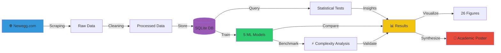

<div align="center">

# 🧠 RAM Pricing Prediction

### Predicting hardware prices using web scraping, statistical inference, and machine learning

[](https://www.python.org/)
[](https://scikit-learn.org/)
[](https://pandas.pydata.org/)
[](https://www.sqlite.org/)

[](LICENSE)
[]()
[](CHANGELOG.md)
[](docs/)
[]()
[]()

**A complete data science pipeline from web scraping to ML model comparison,
including empirical complexity analysis.**

[🚀 Quick Start](#-quick-start) ·
[📊 Results](#-key-results) ·
[🏗️ Architecture](#-architecture) ·
[📚 Documentation](docs/) ·
[🛣️ Roadmap](ROADMAP.md)

---

</div>

## 📌 Overview

This project builds a complete **data science pipeline** to predict the price
of computer RAM modules from their technical specifications. Developed as
an academic project at **Universidad de Guadalajara**, it integrates web
scraping, statistical inference, machine learning, and asymptotic complexity
analysis.

Este proyecto desarrolla un pipeline de ciencia de datos completo para predecir
el precio de los módulos de memoria RAM a partir de sus especificaciones técnicas.
Desarrollado como un proyecto académico en la Universidad de Guadalajara, integra 
web scraping, inferencia estadística, machine learning y análisis de complejidad asintótica.

> **Pregunta de investigación:** *"¿Existe un verdadero sobreprecio por marca en el
> mercado de la memoria RAM, o el precio se explica únicamente por las especificaciones técnicas?"*

**Spoiler:** Both are true. `capacity_gb` dominates (85.6% feature importance),
but CORSAIR commands a **10-35% premium** controlling for technical features.

---

## ✨ Key Results

<div align="center">

### 🏆 Model Performance Comparison

| Model | Type | R² Test | MAPE | MAE | Verdict |
|-------|------|---------|------|-----|---------|
| **Gradient Boosting** | Boosting Ensemble | **0.962** ████████████ | **8.32%** | $52 | 🥇 **Best Predictor** |
| Random Forest | Bagging Ensemble | 0.902 █████████░░ | 10.42% | $71 | 🥈 Non-linear capture |
| OLS | Linear | 0.876 ████████░░░ | 17.36% | $107 | 🎯 **Best for inference** |
| Ridge | L2 Regularized | 0.869 ████████░░░ | 17.45% | $106 | Validates OLS |
| K-Means k=2 | Clustering | N/A | N/A | N/A | Market segmentation |

### 📊 Headline Numbers

| 📦 Dataset | 🏆 Best Model | 📉 Best Error | 🔬 Methods | ⚡ Complexity |
|-----------|---------------|---------------|------------|---------------|
| **350** products | Gradient Boosting | **8.32%** MAPE | **6** paradigms | α=**1.03** validates O(n) |

</div>

---

## 🏗️ Architecture



### 🔬 Six Methodological Paradigms

The project applies **six independent paradigms** to triangulate findings.
Convergence across paradigms strengthens validity.

| # | Paradigm | Method | Role |
|---|----------|--------|------|
| 1 | Inferential | ANOVA + Tukey HSD | Variance decomposition |
| 2 | Parametric Predictive | OLS Regression | Interpretable coefficients |
| 3 | Regularized | Ridge Regression | Relevance detection |
| 4 | Unsupervised | K-Means k=2 | Market segmentation |
| 5 | Bagging Ensemble | Random Forest | Non-linear capture |
| 6 | Boosting Ensemble | Gradient Boosting | Sequential learning |

**All six converge on the same conclusion:** `capacity_gb` is the dominant
predictor, followed by DDR generation, with brand premium as secondary.

---

## 📁 Project Structure

```
ram-pricing-2026/
│
├── 📄 README.md                    ⭐ This file
├── 📄 ROADMAP.md                   🛣️  Project vision
├── 📄 CHANGELOG.md                 📝 Version history
├── 📄 LICENSE                      ⚖️  MIT License
├── 📄 requirements.txt             📦 Dependencies
│
├── 📁 src/                         💻 Modular source code
│   ├── 01_scraping/                🕷️  Web scraping (Day 1-2)
│   ├── 02_data_processing/         🧹 Cleaning + EDA (Day 3)
│   ├── 03_database/                🗄️  SQL + complexity (Day 4)
│   ├── 04_inference/               📊 Statistical tests (Day 5)
│   ├── 05_models/                  🤖 5 ML models (Day 6-8)
│   └── 06_analysis/                ⚡ Final analysis (Day 9)
│
├── 📁 data/                        💾 Datasets
├── 📁 figures/                     🎨 26 visualizations (300 DPI)
├── 📁 docs/                        📚 Comprehensive documentation
├── 📁 tests/                       ✅ Unit tests
├── 📁 scripts/                     🔧 Utility scripts
└── 📁 archive/                     🗄️  Historical diagnostics
```

---

## 🚀 Quick Start

### Prerequisites
- Python **3.10+**
- ~500 MB free disk space
- Internet connection (for scraping)

### Installation

```bash
# Clone the repository
git clone https://github.com/Jnajera96/ram-pricing-2026.git
cd ram-pricing-2026

# Create virtual environment
python -m venv venv

# Activate it
# Windows:
venv\Scripts\activate
# Linux/Mac:
source venv/bin/activate

# Install dependencies
pip install -r requirements.txt
```

### Run the full pipeline

```bash
# Stage 1: Data extraction (~40s)
python src/01_scraping/scraper.py

# Stage 2: Cleaning + EDA (~10s)
python src/02_data_processing/clean.py
python src/02_data_processing/eda.py

# Stage 3: Database + complexity analysis (~12 min)
python src/03_database/create_db.py
python src/03_database/benchmark_pre.py
python src/03_database/create_indices.py
python src/03_database/benchmark_post.py
python src/03_database/benchmark_scaling.py

# Stage 4: Statistical inference (~30s)
python src/04_inference/normality_tests.py
python src/04_inference/ttest_ddr.py
python src/04_inference/anova_ddr.py
python src/04_inference/anova_brand.py
python src/04_inference/dashboard.py

# Stage 5: Train all 5 models (~3 min)
python src/05_models/ols.py
python src/05_models/kmeans.py
python src/05_models/ridge.py
python src/05_models/random_forest.py
python src/05_models/gradient_boosting.py

# Stage 6: Complexity + synthesis (~5 min)
python src/06_analysis/ml_complexity.py
python src/06_analysis/final_dashboard.py
```

---

## 📊 Detailed Findings

### Inferential Statistics

| Test | Statistic | p-value | Effect Size |
|------|-----------|---------|-------------|
| Welch's t (DDR4 vs DDR5) | t = 17.83 | < 0.000001 | Cohen's d = **2.20** |
| ANOVA by DDR | F = 269.24 | < 0.000001 | η² = **0.608** |
| ANOVA by brand | F = 19.84 | < 0.000001 | η² = **0.224** |
| Tukey HSD pairs (DDR) | 3/3 significant | — | All p < 0.001 |
| Tukey HSD pairs (brand) | 6/15 significant | — | 40% significant |

**Interpretation:** DDR generation explains **2.7× more variance** than brand
identity. The market is primarily segmented by technological generation, with
brand acting as a secondary modifier.

### Feature Importance (Gradient Boosting)

```
capacity_gb        ████████████████████████████████████  85.6%
speed_mhz          ███                                    7.1%
ddr_group_legacy   ██                                     3.5%
cas_latency        █                                      1.6%
brand_normalized   █                                     <2%
others             ░                                     <1%
```

### Empirical Complexity Analysis

```
Model              α (empirical)    Implication
─────────────────────────────────────────────────────────────────
Gradient Boosting  1.03            ✅ Validates O(n) exactly
Random Forest      0.72            Parallelism hides true growth
K-Means            0.64            Iterative convergence behavior
OLS                0.46            BLAS/LAPACK optimization
Ridge              0.42            BLAS/LAPACK optimization
```

**75 measurements** total (5 models × 5 sizes × 3 repetitions).
Dataset scaled from n=1,000 to n=100,000 to allow asymptotic exponents to emerge.

---

## 📚 Documentation

Comprehensive documentation in [`docs/`](docs/):

| Document | Description |
|----------|-------------|
| [📖 methodology.md](docs/methodology.md) | Six-paradigm research framework |
| [🏗️ architecture.md](docs/architecture.md) | Technical implementation details |
| [📊 results.md](docs/results.md) | Detailed findings per analysis stage |
| [🤖 models_comparison.md](docs/models_comparison.md) | In-depth model evaluation |
| [⚡ complexity_analysis.md](docs/complexity_analysis.md) | Asymptotic complexity validation |

---

## 🛠️ Tech Stack

<div align="center">

### Data Science


### Visualization


### Web & Storage


### DevOps


</div>

---

## 🛣️ Roadmap

```
✅ Phase 1: Academic Foundation (COMPLETED · May 2026)
   • Complete data science pipeline
   • 5 predictive models
   • Empirical complexity analysis
   • Academic poster

🚀 Phase 2: Web Application (Q3 2026)
   • Interactive React dashboard
   • FastAPI backend with prediction API
   • Deployment with Docker + CI/CD

📊 Phase 3: Data Expansion (Q4 2026)
   • Multi-source scraping (Amazon, Best Buy)
   • Time-series analysis
   • Advanced models (XGBoost, deep learning)

🌐 Phase 4: Production Features (Future)
   • User accounts, price alerts
   • Recommendation engine
   • Mobile app
```

**Full details:** [ROADMAP.md](ROADMAP.md)

---

## 👥 Contributors

This project was developed collaboratively at Universidad de Guadalajara:

<table>
<tr>
<td align="center" width="25%">
<strong>José Najera</strong><br/>
<sub>Project Lead</sub><br/>
Architecture, scraping,<br/>
inference, K-Means, Ridge,<br/>
RF, GB, complexity analysis
</td>
<td align="center" width="25%">
<strong>Bernardo Maciel</strong><br/>
<sub>Regression Specialist</sub><br/>
OLS regression, Gauss-Markov<br/>
validation, residual analysis
</td>
<td align="center" width="25%">
<strong>Juan Pablo Cruz</strong><br/>
<sub>SQL Analyst</sub><br/>
Query optimization,<br/>
benchmark analysis
</td>
<td align="center" width="25%">
<strong>Diego De Jesús</strong><br/>
<sub>Visual Communication</sub><br/>
Poster design, SQL,<br/>
defense materials
</td>
</tr>
</table>

---

## 📖 Academic Context

This project was developed for two courses:

- **Asymptotic Notation** · Analysis of O(n), O(log n), and empirical exponents
- **Bayesian Inference** · Informative priors and conditional imputation

**Defense date:** May 19, 2026

---

## 📜 License

This project is licensed under the **MIT License** — see [LICENSE](LICENSE) for details.

Data scraped from Newegg.com is used **solely for educational purposes**.
Product names, brands, and prices are property of their respective owners.

---

## 🤝 Acknowledgments

- **Universidad de Guadalajara** for academic support
- **Centro Universitario de Guadalajara** (CUGDL)
- Open source community for the incredible tools used
- The 350 RAM products that gave their data to science 💾

---

<div align="center">

### ⭐ If you found this project useful, please consider starring the repository!

**Made with ❤️ and ☕ at Universidad de Guadalajara · 2026**

[🔝 Back to top](#-ram-pricing-prediction)

</div>
