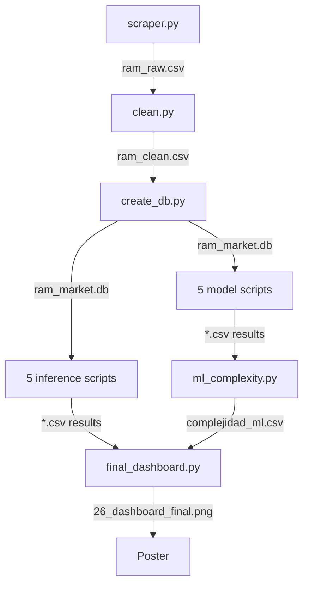

# 🏗️ Technical Architecture

> Implementation details of the RAM Pricing Prediction system
> University of Guadalajara · Data Science · May 2026

---

## 📐 System Overview

The project is structured as a **modular data science pipeline** with six
independent stages, each implementable and testable in isolation.

```
┌──────────────────────────────────────────────────────────────────┐
│                        DATA SCIENCE PIPELINE                      │
├──────────────────────────────────────────────────────────────────┤
│                                                                    │
│  ┌─────────┐    ┌────────┐    ┌──────┐    ┌──────────┐          │
│  │ Scrape  │───>│ Clean  │───>│ Store│───>│ Inference │          │
│  └─────────┘    └────────┘    └──────┘    └──────────┘          │
│                                                │                  │
│                                                ▼                  │
│                                       ┌──────────────┐           │
│                                       │ 5 ML Models  │           │
│                                       └──────────────┘           │
│                                                │                  │
│                                                ▼                  │
│                                       ┌──────────────┐           │
│                                       │  Complexity  │           │
│                                       └──────────────┘           │
│                                                │                  │
│                                                ▼                  │
│                                       ┌──────────────┐           │
│                                       │   Synthesis  │           │
│                                       └──────────────┘           │
│                                                                    │
└──────────────────────────────────────────────────────────────────┘
```

---

## 🧱 Module Specifications

### Module 1: `src/01_scraping/` · Web Scraping Layer

**Purpose:** Extract product data from Newegg.com.

**Files:**
- `scraper.py` · Main extractor with multi-strategy parsers
- `recalcular_cas.py` · CAS Latency reprocessing utility
- `web_scraping.py` · Initial exploration script

**Key Design Decisions:**
- HTTP via `requests` library (no headless browser)
- HTML parsing via `BeautifulSoup4` with `lxml` backend
- Forced `gzip` encoding (Brotli rejected due to dependency issues)
- Multi-strategy regex parsers in cascade
- `dataclass` for type-safe product representation

**Output:** `data/raw/ram_raw.csv` (359 products)

---

### Module 2: `src/02_data_processing/` · Data Cleaning

**Purpose:** Transform raw data into analysis-ready format.

**Files:**
- `clean.py` · Complete cleaning pipeline
- `eda.py` · Exploratory data analysis

**Key Design Decisions:**
- Bayesian-light imputation: median by DDR generation (51 missing CAS values)
- Log transformation: `log(price_usd)` for normality
- Feature engineering: 7 derived columns
- One-hot encoding with `drop_first=True` to avoid collinearity

**Output:**
- `data/processed/ram_clean.csv` (350 products, 17 columns)
- 3 EDA figures at 300 DPI

---

### Module 3: `src/03_database/` · Storage & Query Optimization

**Purpose:** Persist data and benchmark query complexity.

**Files:**
- `create_db.py` · SQLite database construction
- `create_indices.py` · B-Tree index creation
- `benchmark_pre.py` · Pre-index query timings
- `benchmark_post.py` · Post-index query timings
- `benchmark_scaling.py` · Scaling test (n: 350 → 50,000)

**Schema:**
```sql
CREATE TABLE ram_products (
    id INTEGER PRIMARY KEY,
    title TEXT NOT NULL,
    brand TEXT,
    brand_normalized TEXT,
    ddr_type TEXT,
    capacity_gb REAL,
    speed_mhz INTEGER,
    cas_latency INTEGER,
    num_sticks INTEGER,
    has_rgb INTEGER,
    price_usd REAL,
    log_price REAL,
    -- ... derived columns
);

CREATE INDEX idx_brand ON ram_products(brand_normalized);
CREATE INDEX idx_ddr ON ram_products(ddr_type);
CREATE INDEX idx_capacity ON ram_products(capacity_gb);
```

**Key Design Decisions:**
- `time.perf_counter()` for nanosecond resolution
- Median of N=100 runs per query (robust to GC interruptions)
- Empirical scaling test up to n=50,000

---

### Module 4: `src/04_inference/` · Statistical Inference

**Purpose:** Validate distributional assumptions and test hypotheses.

**Files:**
- `normality_tests.py` · Shapiro-Wilk, Levene
- `ttest_ddr.py` · Welch's t-test (DDR4 vs DDR5)
- `anova_ddr.py` · ANOVA + Tukey HSD by DDR
- `anova_brand.py` · ANOVA + Tukey HSD by brand
- `dashboard.py` · Consolidated inferential dashboard

**Test Hierarchy:**
```
1. Normality check (Shapiro-Wilk)
   ├─> Normal? Use parametric (t-test, ANOVA)
   └─> Non-normal? Use non-parametric (Mann-Whitney, Kruskal-Wallis)

2. Variance check (Levene)
   ├─> Equal? Standard t-test, ANOVA
   └─> Unequal? Welch's correction

3. Post-hoc (after ANOVA significant)
   └─> Tukey HSD with family-wise error control
```

---

### Module 5: `src/05_models/` · Machine Learning Models

**Purpose:** Train, tune, and evaluate predictive models.

**Files:**
- `ols.py` · Model 1 (Bernardo Maciel)
- `kmeans.py` · Model 2
- `ridge.py` · Model 3
- `random_forest.py` · Model 4
- `gradient_boosting.py` · Model 5

**Shared Conventions:**
- Train/test split: 80/20 with `random_state=42`
- Same feature set across all models (comparability)
- GridSearchCV with 5-fold for hyperparameters
- Cross-validation for robustness check
- Multiple metrics reported (R², MAPE, MAE, RMSE)

**Pipeline Per Model:**
```
1. Load data from SQLite
2. Feature engineering (same for all)
3. Train/test split (same random_state)
4. GridSearchCV (model-specific grid)
5. Final fit with best hyperparameters
6. Evaluate on test set
7. Generate diagnostic figures
8. Save results to CSV
```

---

### Module 6: `src/06_analysis/` · Synthesis Layer

**Purpose:** Empirical complexity analysis and final synthesis.

**Files:**
- `ml_complexity.py` · Time scaling benchmarks for 5 models
- `final_dashboard.py` · 6-panel master visualization

**Complexity Methodology:**
```python
# For each model and each n in [1000, 5000, 20000, 50000, 100000]:
#   1. Replicate dataset to size n (with light noise)
#   2. Measure fit time (median of 3 runs)
#   3. Record time_seg

# Log-log regression:
#   time = c * n^alpha
#   alpha = polyfit(log(n), log(time), degree=1)[0]
```

---

## 🔄 Data Flow



---

## ⚙️ Configuration Conventions

### Reproducibility
```python
RANDOM_STATE = 42  # In all models
TRAIN_SIZE = 0.8   # In all train/test splits
CV_FOLDS = 5        # In all GridSearchCV
```

### Paths
```python
SCRIPT_DIR = Path(__file__).parent  # Robust against any move
DATA_DIR = SCRIPT_DIR / "data"
FIG_DIR = SCRIPT_DIR / "figures"
```

### Visualization
```python
sns.set_style("whitegrid")
plt.rcParams['figure.dpi'] = 100
plt.rcParams['savefig.dpi'] = 300  # Publication quality
```

---

## 🛡️ Error Handling Strategy

Each module implements:

1. **Graceful degradation:** Catch exceptions per item, not per batch
2. **Detailed logging:** Print intermediate state for debugging
3. **Validation gates:** Check data types and ranges before operations
4. **Backup before overwrite:** Always backup CSVs before modifications

Example pattern:
```python
try:
    process_item(item)
except Exception as e:
    print(f"⚠️  Failed item {item['id']}: {e}")
    failed_items.append(item)
    continue  # Move to next, don't crash batch
```

---

## 📊 Output Conventions

### CSV files
- UTF-8 encoding
- Header always present
- Comma-separated values
- Stored in `data/results/`

### Figures
- PNG format at 300 DPI
- Numbered sequentially (01-26)
- Stored in `figures/`
- Descriptive filenames (e.g., `08_anova_ddr.png`)

### Logs
- Console output during execution
- Structured with sections (using `═` separators)
- Emoji prefixes for visual scanning

---

## 🔌 Extension Points

The architecture supports several extension patterns:

### Adding a new model
1. Create `src/05_models/your_model.py`
2. Follow the same pipeline structure (load → split → fit → evaluate)
3. Use the shared train/test split for comparability
4. Save results to `data/results/your_model_results.csv`

### Adding a new data source
1. Create `src/01_scraping/your_source.py`
2. Output to `data/raw/your_source.csv`
3. Update `clean.py` to merge multiple sources

### Adding a new analysis
1. Create script in `src/06_analysis/`
2. Read from `data/results/` (NOT from scratch)
3. Output figures with sequential numbering

---

## 📚 Related Documentation

- [📖 methodology.md](methodology.md) · Research framework
- [📊 results.md](results.md) · Detailed findings
- [🤖 models_comparison.md](models_comparison.md) · Model evaluation
- [⚡ complexity_analysis.md](complexity_analysis.md) · Asymptotic analysis

---

*Last updated: May 15, 2026*
